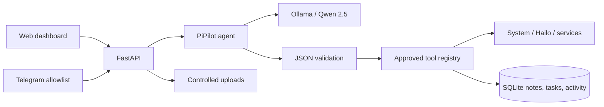

# PiPilot

PiPilot is a private, local AI personal assistant designed for Raspberry Pi with a Hailo-8 AI HAT. It combines a FastAPI service, Ollama/Qwen, a secured Telegram bot, a React operations dashboard, persistent notes and tasks, real device monitoring, and a controlled local-file assistant.

Ollama runs Qwen separately. PiPilot detects and monitors Hailo-8 hardware but does **not** claim that Hailo accelerates Ollama.

## Architecture



The LLM cannot execute shell text. Its structured selection is parsed with Pydantic and resolved against a fixed registry. Hardware commands use fixed argument arrays, timeouts, and `shell=False` semantics.

## Features

- Local Qwen chat with conversation history and graceful Ollama-offline behavior
- Live CPU, load, temperature, memory, disk, uptime, network, OS, model, and process information
- Ollama reachability/model readiness and response-time monitoring
- Cross-platform Hailo-8 detection through `hailortcli fw-control identify`
- Shared SQLite notes, tasks, uploads, and high-level audit activity
- Full task CRUD with Telegram inline Complete/Delete controls and per-user Telegram ownership
- Scheduled and recurring reminders with Telegram delivery plus daily device/task briefings
- Persistent dashboard chat history stored locally in SQLite
- Optional real current weather through Open-Meteo when coordinates are configured
- Telegram `/start`, `/help`, `/status`, `/health`, `/notes`, `/tasks`, plus natural language
- Telegram voice notes transcribed locally by the optional Hailo-8 Whisper pipeline
- Telegram numeric user allowlist; rejected content is not logged
- Upload-limited `.txt`, `.md`, `.json`, `.log`, and text-based `.pdf` assistant with controlled deletion
- Responsive dashboard and `/demo` presentation route (all metrics remain real)
- macOS-safe fallbacks when Linux/Raspberry Pi capabilities are absent

Screenshot placeholders: `docs/screenshots/dashboard.png`, `docs/screenshots/assistant.png`.

## macOS development

Requirements: Python 3.11+, Node 20+, npm, and Ollama.

```bash
git clone <repository>
cd pipilot
python3 -m venv .venv
source .venv/bin/activate
pip install -r backend/requirements-dev.txt
npm --prefix frontend install
cp .env.example .env
ollama pull qwen2.5:1.5b
./scripts/dev.sh
```

Open `http://localhost:5173`. Hailo, Pi temperature, and systemd correctly show as unavailable where macOS cannot supply them.

## Raspberry Pi deployment

Install Raspberry Pi OS 64-bit, Python 3, Node/npm, Ollama, and the vendor Hailo runtime/tools first. Then:

```bash
git clone <repository> /opt/pipilot
cd /opt/pipilot
python3 -m venv .venv
source .venv/bin/activate
pip install -r backend/requirements.txt
npm --prefix frontend install
cp .env.example .env
# edit .env
ollama pull qwen2.5:1.5b
./scripts/build-frontend.sh
./scripts/start.sh
```

For another directory or account, edit `User`, `Group`, `WorkingDirectory`, `EnvironmentFile`, `ExecStart`, and `ReadWritePaths` in the unit. Recommended dedicated install:

```bash
sudo useradd --system --home /opt/pipilot --shell /usr/sbin/nologin pipilot
sudo chown -R pipilot:pipilot /opt/pipilot
sudo cp deployment/pipilot.service /etc/systemd/system/
sudo systemctl daemon-reload
sudo systemctl enable pipilot
sudo systemctl start pipilot
sudo systemctl status pipilot
```

Open `http://<pi-ip>:8000`. Use a firewall and trusted LAN/VPN; the MVP web UI has no user authentication and must not be exposed directly to the public internet.

## Ollama and Qwen

Set `OLLAMA_URL` and `OLLAMA_MODEL` in `.env`. Verify independently and through PiPilot:

```bash
curl http://localhost:11434/api/tags
ollama list
curl http://localhost:8000/api/ollama/status
```

`model_ready` must be `true`. If Ollama only binds to loopback, PiPilot can still reach it when both run on the Pi.

## Telegram setup

1. In Telegram, talk to BotFather, create a bot, and copy its token.
2. Obtain your numeric user ID using a trusted ID bot or Telegram Bot API update during setup.
3. Put the token in `TELEGRAM_BOT_TOKEN` and comma-separated IDs in `TELEGRAM_ALLOWED_USER_IDS`.
4. Restart PiPilot. The dashboard should show Telegram connected.
5. Send `/start`, then `Give me a system health report`.

Never commit `.env`. Unauthorized users receive only `Unauthorized.`; rejected message contents and secrets are not logged.

## Hailo verification

```bash
hailortcli fw-control identify
curl http://localhost:8000/api/hailo/status
```

Expected fields include `detected`, `device`, `firmware`, `architecture`, and `status`. Install the matching HailoRT package if `hailortcli` is missing. Detection only reports the edge accelerator—it does not associate it with Qwen/Ollama inference.

### Hailo-8 Telegram voice notes

PiPilot uses Hailo's standalone Whisper application for Hailo-8/8L. Hailo performs speech-to-text; Ollama/Qwen separately interprets the transcript and the approved tool registry performs actions.

Install the official Hailo Apps speech-recognition environment on the Pi (after installing the HailoRT driver and Python binding):

```bash
sudo apt update
sudo apt install -y ffmpeg libportaudio2 python3-venv git
cd /opt
sudo git clone https://github.com/hailo-ai/hailo-apps.git
sudo chown -R pipilot:pipilot /opt/hailo-apps
sudo -u pipilot python3 -m venv --system-site-packages /opt/hailo-apps/venv
sudo -u pipilot /opt/hailo-apps/venv/bin/pip install -e '/opt/hailo-apps[speech-rec]'
```

Confirm `.env` contains:

```dotenv
PIPILOT_VOICE_MAX_SECONDS=60
HAILO_STT_PYTHON=/opt/hailo-apps/venv/bin/python
HAILO_STT_VARIANT=base
```

Verify the installed application before restarting PiPilot:

```bash
sudo -u pipilot /opt/hailo-apps/venv/bin/python -m hailo_apps.python.standalone_apps.speech_recognition.speech_recognition --list-models --arch hailo8
sudo systemctl restart pipilot
```

The first transcription may download Hailo model resources and take longer. Send a Telegram voice note such as “Add rehearse presentation to my tasks.” PiPilot downloads it to a temporary controlled directory, converts it to mono 16 kHz audio, transcribes it on Hailo-8, deletes the temporary audio, passes the transcript to the normal agent, and displays the action on Live Demo.

## API

Core routes: `GET /api/health`, `/api/status`, `/api/system`, `/api/system/processes`, `/api/ollama/status`, `/api/hailo/status`, `/api/memories`, `/api/tasks`, `/api/files`, `/api/activity`; `POST /api/chat`, `/api/memories`, `/api/tasks`, `/api/files`, `/api/files/{id}/ask`; `PATCH /api/tasks/{id}`; and delete routes for memories/tasks. Interactive docs are at `/docs` during backend-only development.

Additional productivity routes include `GET/DELETE /api/chat/history`, `GET/POST /api/reminders`, `DELETE /api/reminders/{id}`, `GET /api/voice/history`, and `DELETE /api/files/{id}`.

## Reminders, briefings, and weather

Configure the local timezone and daily briefing hour (0-23) in `.env`:

```dotenv
PIPILOT_TIMEZONE=Africa/Johannesburg
PIPILOT_DAILY_BRIEFING_HOUR=7
```

Examples:

```text
Remind me tomorrow at 9 to rehearse my presentation.
Remind me in 30 minutes to check the dashboard.
Remind me every day at 8 to review my tasks.
Show my reminders.
Cancel reminder 3.
```

The scheduler runs inside the PiPilot service and persists reminder state in SQLite. Web-created reminders are assigned to the first configured `TELEGRAM_ALLOWED_USER_IDS` entry. A daily briefing is delivered once per local calendar day and includes pending tasks plus real Pi/Ollama status.

Weather is disabled until explicit coordinates are configured:

```dotenv
PIPILOT_WEATHER_LOCATION=Johannesburg
PIPILOT_WEATHER_LATITUDE=-26.2041
PIPILOT_WEATHER_LONGITUDE=28.0473
```

Then ask “What is the current weather?” Weather is the only feature in this group that requires an external internet request; the response identifies Open-Meteo as its source. Private memories and task content are not sent to the weather service.

## Demo walkthrough

1. Put the laptop dashboard on `/demo`; show real device cards and the local-inference badge.
2. Send `Give me a system health report` in Telegram; point out tool selection and live values.
3. Send `Is Ollama running?` and `Is the Hailo accelerator detected?`.
4. Send `Remember that my presentation is tomorrow`, then `What do you remember?`; watch Memory update.
5. Send `Add buy HDMI cable to my tasks`, then open Tasks and complete it.
6. Upload a small log and ask PiPilot to identify errors.
7. Show Activity to explain the audit trail without chain-of-thought.

## Security and limitations

Service restarts are available through Telegram only: `Restart pipilot` (or another configured service) creates server-side confirmation state, and a separate `Confirm` message executes the fixed allowlisted action. Natural-language due-date extraction is not yet implemented; precise due dates are accepted by the REST API. Chat history is supplied by the browser and is not persisted. The file assistant truncates context to keep Qwen/Raspberry Pi resource use bounded. The web interface currently assumes a trusted private network.

Troubleshooting: use `./scripts/health-check.sh`, `journalctl -u pipilot -f`, `ollama list`, and `/api/status`. If Telegram is disconnected, verify the token, allowed numeric IDs, outbound internet connectivity for the Telegram API, and service logs.
