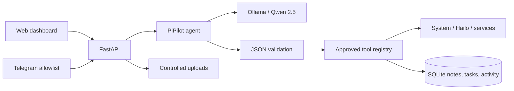

# PiPilot

PiPilot is a private, local AI personal assistant designed for Raspberry Pi with a Hailo-8 AI HAT. It combines a FastAPI service, Ollama/Qwen, a secured Telegram bot, a React operations dashboard, persistent notes and tasks, real device monitoring, and a controlled local-file assistant.

Ollama runs Qwen separately. PiPilot detects and monitors Hailo-8 hardware but does **not** claim that Hailo accelerates Ollama.

## Architecture



The LLM cannot execute shell text. Its structured selection is parsed with Pydantic and resolved against a fixed registry. Hardware commands use fixed argument arrays, timeouts, and `shell=False` semantics.

## Features

- Local Qwen chat with conversation history and graceful Ollama-offline behavior
- Live CPU, load, temperature, memory, disk, uptime, network, OS, model, and process information
- Ollama reachability/model readiness and response-time monitoring
- Cross-platform Hailo-8 detection through `hailortcli fw-control identify`
- Shared SQLite notes, tasks, uploads, and high-level audit activity
- Telegram `/start`, `/help`, `/status`, `/health`, `/notes`, `/tasks`, plus natural language
- Telegram numeric user allowlist; rejected content is not logged
- Upload-limited `.txt`, `.md`, `.json`, and `.log` assistant
- Responsive dashboard and `/demo` presentation route (all metrics remain real)
- macOS-safe fallbacks when Linux/Raspberry Pi capabilities are absent

Screenshot placeholders: `docs/screenshots/dashboard.png`, `docs/screenshots/assistant.png`.

## macOS development

Requirements: Python 3.11+, Node 20+, npm, and Ollama.

```bash
git clone <repository>
cd pipilot
python3 -m venv .venv
source .venv/bin/activate
pip install -r backend/requirements-dev.txt
npm --prefix frontend install
cp .env.example .env
ollama pull qwen2.5:1.5b
./scripts/dev.sh
```

Open `http://localhost:5173`. Hailo, Pi temperature, and systemd correctly show as unavailable where macOS cannot supply them.

## Raspberry Pi deployment

Install Raspberry Pi OS 64-bit, Python 3, Node/npm, Ollama, and the vendor Hailo runtime/tools first. Then:

```bash
git clone <repository> /opt/pipilot
cd /opt/pipilot
python3 -m venv .venv
source .venv/bin/activate
pip install -r backend/requirements.txt
npm --prefix frontend install
cp .env.example .env
# edit .env
ollama pull qwen2.5:1.5b
./scripts/build-frontend.sh
./scripts/start.sh
```

For another directory or account, edit `User`, `Group`, `WorkingDirectory`, `EnvironmentFile`, `ExecStart`, and `ReadWritePaths` in the unit. Recommended dedicated install:

```bash
sudo useradd --system --home /opt/pipilot --shell /usr/sbin/nologin pipilot
sudo chown -R pipilot:pipilot /opt/pipilot
sudo cp deployment/pipilot.service /etc/systemd/system/
sudo systemctl daemon-reload
sudo systemctl enable pipilot
sudo systemctl start pipilot
sudo systemctl status pipilot
```

Open `http://<pi-ip>:8000`. Use a firewall and trusted LAN/VPN; the MVP web UI has no user authentication and must not be exposed directly to the public internet.

## Ollama and Qwen

Set `OLLAMA_URL` and `OLLAMA_MODEL` in `.env`. Verify independently and through PiPilot:

```bash
curl http://localhost:11434/api/tags
ollama list
curl http://localhost:8000/api/ollama/status
```

`model_ready` must be `true`. If Ollama only binds to loopback, PiPilot can still reach it when both run on the Pi.

## Telegram setup

1. In Telegram, talk to BotFather, create a bot, and copy its token.
2. Obtain your numeric user ID using a trusted ID bot or Telegram Bot API update during setup.
3. Put the token in `TELEGRAM_BOT_TOKEN` and comma-separated IDs in `TELEGRAM_ALLOWED_USER_IDS`.
4. Restart PiPilot. The dashboard should show Telegram connected.
5. Send `/start`, then `Give me a system health report`.

Never commit `.env`. Unauthorized users receive only `Unauthorized.`; rejected message contents and secrets are not logged.

## Hailo verification

```bash
hailortcli fw-control identify
curl http://localhost:8000/api/hailo/status
```

Expected fields include `detected`, `device`, `firmware`, `architecture`, and `status`. Install the matching HailoRT package if `hailortcli` is missing. Detection only reports the edge accelerator—it does not associate it with Qwen/Ollama inference.

## API

Core routes: `GET /api/health`, `/api/status`, `/api/system`, `/api/system/processes`, `/api/ollama/status`, `/api/hailo/status`, `/api/memories`, `/api/tasks`, `/api/files`, `/api/activity`; `POST /api/chat`, `/api/memories`, `/api/tasks`, `/api/files`, `/api/files/{id}/ask`; `PATCH /api/tasks/{id}`; and delete routes for memories/tasks. Interactive docs are at `/docs` during backend-only development.

## Demo walkthrough

1. Put the laptop dashboard on `/demo`; show real device cards and the local-inference badge.
2. Send `Give me a system health report` in Telegram; point out tool selection and live values.
3. Send `Is Ollama running?` and `Is the Hailo accelerator detected?`.
4. Send `Remember that my presentation is tomorrow`, then `What do you remember?`; watch Memory update.
5. Send `Add buy HDMI cable to my tasks`, then open Tasks and complete it.
6. Upload a small log and ask PiPilot to identify errors.
7. Show Activity to explain the audit trail without chain-of-thought.

## Security and limitations

Service restarts are available through Telegram only: `Restart pipilot` (or another configured service) creates server-side confirmation state, and a separate `Confirm` message executes the fixed allowlisted action. Natural-language due-date extraction is not yet implemented; precise due dates are accepted by the REST API. Chat history is supplied by the browser and is not persisted. The file assistant truncates context to keep Qwen/Raspberry Pi resource use bounded. The web interface currently assumes a trusted private network.

Troubleshooting: use `./scripts/health-check.sh`, `journalctl -u pipilot -f`, `ollama list`, and `/api/status`. If Telegram is disconnected, verify the token, allowed numeric IDs, outbound internet connectivity for the Telegram API, and service logs.
